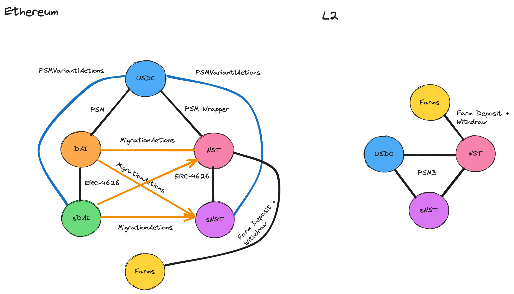

# Spark User Actions


[![Foundry][foundry-badge]][foundry]
[](https://github.com/marsfoundation/spark-user-actions/blob/master/LICENSE)

[foundry]: https://getfoundry.sh/
[foundry-badge]: https://img.shields.io/badge/Built%20with-Foundry-FFDB1C.svg

# Overview

Common user actions in the Maker ecosystem related to DAI, sDAI, USDS, sUSDS, and USDC. USDT is unsupported because of a lack of first-class support in Maker at this time. USDT can be supported if Maker infrastructure is added in the future. Users wanting to enter or exit via USDT need to use DEX aggregators such as Cowswap.

These contracts are not meant to exhaustively cover all use cases, but group common actions where there is more than 1 transaction required. For example, swapping from USDC to sDAI is covered, but not DAI to sDAI because there is already a `deposit(...)` function on the sDAI contract.

These contracts are designed to revert when edge cases present themselves such as the PSM being empty or at max debt capacity. Users should feel confident that in the worst case their transaction will fail instead of losing part of their principal.

These contracts will be deployed at well-known addresses to be used across the Maker ecosystem.

# Top Level Actions Mapping

Below is a diagram that outlines the top-level actions that can be taken by a user and the contracts that are used to facilitate these actions.



## Ethereum (Original PSM - Variant 1)

- `DAI <-> sDAI`: sDAI ERC-4626 interface
- `USDC <-> DAI`: Use PSM directly
- `USDC <-> sDAI`: PSMVariant1Actions

## Ethereum (PSM Lite - Variant 2)

- `DAI <-> sDAI`: sDAI ERC-4626 interface
- `USDC <-> DAI`: Use PSM directly
- `USDC <-> sDAI`: PSMVariant1Actions

*Note: No code changes are needed. Only a redeploy of `PSMVariant1Actions`.*

## Ethereum (PSM Wrapper - Variant 3)

- `USDS <-> sUSDS`: sUSDS ERC-4626 interface
- `USDC <-> USDS`: [UsdsPsmWrapper](https://github.com/makerdao/usds-wrappers/blob/dev/src/UsdsPsmWrapper.sol)
- `USDC <-> sUSDS`: PSMVariant1Actions
- `USDS <-> Farms`: Directly deposit/withdraw

## Ethereum (Migration Actions)

- `DAI <-> USDS`: MigrationActions
- `sDAI -> USDS`: MigrationActions
- `DAI -> sUSDS`: MigrationActions
- `sDAI -> sUSDS`: MigrationActions

## Non-Ethereum chains

A three-way PSM will be provided here: https://github.com/marsfoundation/spark-psm. This can be used directly by UIs.

- `USDS <-> sUSDS`: Swap in PSM
- `USDC <-> USDS`: Swap in PSM
- `USDC <-> sUSDS`: Swap in PSM
- `USDS <-> Farms`: Directly deposit/withdraw

# Contracts

## PSMVariant1Actions

Intended to be used with the first version of the USDC PSM at `0x89B78CfA322F6C5dE0aBcEecab66Aee45393cC5A` and sDAI, but also compatible with the newer lite psm and USDS wrapper.

The code is written in a general way, but it is expected for this to be used with the USDC PSM and sDAI. Please note that all values are measured in either USDC or DAI and not sDAI shares. This keeps the UI simple in that you can specify `100e18` of sDAI to mean "100 DAI worth of sDAI" instead of doing the share conversion.

Deployed at (Original PSM): [0x52d298ff9e77e71c2eb1992260520e7b15257d99](https://etherscan.io/address/0x52d298ff9e77e71c2eb1992260520e7b15257d99)  
Deployed at (PSM Lite): [0x5803199F1085d52D1Bb527f24Dc1A2744e80A979](https://etherscan.io/address/0x5803199F1085d52D1Bb527f24Dc1A2744e80A979)  
Deployed at (USDS PSM Wrapper): TBD  

### swapAndDeposit

```solidity
function swapAndDeposit(
    address receiver,
    uint256 amountIn,
    uint256 minAmountOut
) external returns (uint256 amountOut);
```

Deposit `amountIn` USDC and swap it for at least `minAmountOut` sDAI (measured in DAI units). Send the sDAI to the `receiver`. Returns `amountOut` that was sent to the receiver in sDAI (measured in DAI units).

Example:

```solidity
// Use exact approvals for safety
usdc.approve(address(actions), 100e6);
actions.swapAndDeposit(address(this), 100e6, 100e18);
// User has 100 DAI worth of sDAI
```

### withdrawAndSwap

```solidity
function withdrawAndSwap(
    address receiver,
    uint256 amountOut,
    uint256 maxAmountIn
) external returns (uint256 amountIn);
```

There are two types of "withdrawals". The first is when you want an exact output measured in USDC. You can also use this to send another account an exact payment. In this case it is important not to send dust to the user.

Sends at most `maxAmountIn` sDAI (measured in DAI units) and swap it for exactly `amountOut` USDC. Send the USDC to the `receiver`. Returns `amountIn` that was the amount of sDAI used to withdraw USDC (measured in DAI units).

Example:

```solidity
// Use exact approvals for safety
// +1 is to prevent rounding errors
sDAI.approve(address(actions), sDAI.convertToShares(100e18) + 1);
actions.withdrawAndSwap(address(this), 100e6, 100e18);
// User has 100 USDC
```

### redeemAndSwap

```solidity
function redeemAndSwap(
    address receiver,
    uint256 shares,
    uint256 minAmountOut
) external returns (uint256 amountOut);
```

This is the second type of "withdrawal" where a user wants to withdraw all of their sDAI balance to USDC. This method is better because it will not leave dust like in the previous function.

Sends `shares` sDAI (measured in sDAI shares) and swap it for at least `minAmountOut` USDC. Send the USDC to the `receiver`. Returns `amountOut` that was sent to the receiver in USDC.

Example:

```solidity
// Use exact approvals for safety
uint256 bal = sDAI.balanceOf(address(this));
sDAI.approve(address(actions), bal);
actions.redeemAndSwap(address(this), bal, sDAI.convertToAssets(bal));
// User has withdrawn as much USDC as possible
```

## MigrationActions

This contract is used to upgrade from DAI, sDAI to USDS, sUSDS. Also contains a downgrade path for USDS -> DAI for backwards compatibility.

Below is a diagram that outlines the migration path from sDAI to sUSDS. This migration path is the most complex and all other paths are subsets of this one.


# Test

To run testing, use the following command:

```bash
forge test
```

Forked integration tests are built off of the MakerDAO staging environment on Tenderly. Prior to running the tests, ensure that the `TENDERLY_STAGING_URL` environment variable is set to the correct RPC URL.

***
*The IP in this repository was assigned to Mars SPC Limited in respect of the MarsOne SP*
